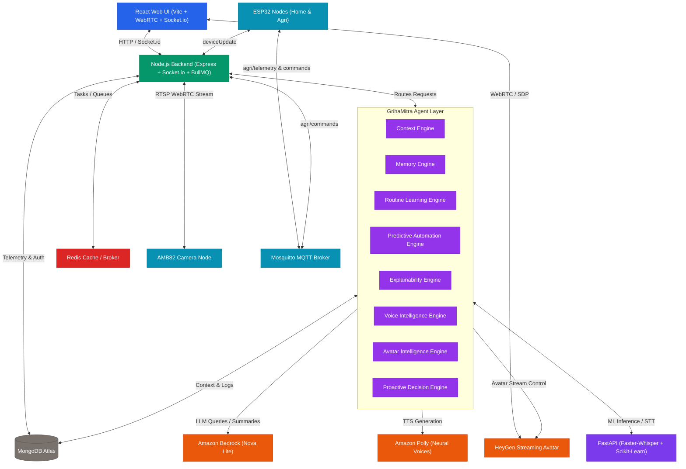

# 🏛️ Sapno Ka Ghar (GrihaMitra) - System Architecture

This document defines the system-wide architecture of the **Sapno Ka Ghar** (GrihaMitra) smart home ecosystem. It outlines the modular components, the centralized agentic intelligence orchestrator, cloud services, and real-time interaction patterns that enable context-aware AI automation, real-time telemetry, and natural human-avatar companion dialogue.

---

## 🏗️ 1. High-Level Architectural Design

GrihaMitra operates as a hybrid local-cloud smart ecosystem driven by an intelligent agentic core. High-performance, low-latency client communication is paired with the centralized **GrihaMitra Agent Layer**, which orchestrates all reasoning, context-awareness, predictive automation, and avatar interactions before interfacing with cloud AI services.



---

## 🛠️ 2. Subsystem & Component Stack

The system is partitioned into logically isolated layers to enforce a clean separation of concerns and establish an enterprise-grade agentic workflow.

### A. Frontend Layer (React Web App)
- **Vite & React JS**: Powers the high-performance smart dashboard client.
- **Socket.io-client**: Receives instant device status updates, toaster notifications, and proactive avatar alerts.
- **WebRTC Client**: Establishes peer-to-peer connections with the HeyGen streaming avatar and AMB82 smart camera nodes.

### B. Core API Layer (Node.js Backend)
- **Express Server**: Exposes secure REST API endpoints with JWT multi-tenant authentication.
- **Socket.io**: Broadcasts synchronized device state updates to multiple displays.
- **BullMQ Integration**: Manages multiple job queues (Redis) for asynchronous AI task offloading.

### C. GrihaMitra Agent Layer (Central Intelligence)
This layer acts as the brain of the smart home, routing decisions and orchestrating AI components:
- **Context Engine**: Aggregates family profiles, room states, sensor readings, active routines, and conversation history to build a unified context window for reasoning.
- **Memory Engine**: Retrieves information from `AvatarMemory`, `ConversationSession`, `VoiceHistory`, and `EventHistory`. Supports semantic recall and long-term memory retrieval.
- **Routine Learning Engine**: Learns recurring user behaviors and generates high-confidence `AIRoutine` records based on daily patterns.
- **Predictive Automation Engine**: Uses Scikit-Learn predictions and event history to decide whether actions should be executed automatically, recommended, or rejected.
- **Explainability Engine**: Generates human-readable explanations for AI decisions. Creates `ExplainabilityRecord` logs and confidence breakdowns.
- **Voice Intelligence Engine**: Processes Faster-Whisper transcripts, performs intent classification, confidence scoring, language detection, and dialogue management.
- **Avatar Intelligence Engine**: Controls the HeyGen Streaming Avatar, managing emotion mapping, proactive speaking, memory-based responses, and personality adaptation.
- **Proactive Decision Engine**: Detects critical anomalies (Security alerts, Water tank issues, Power failures, Routine reminders) and schedules announcements using BullMQ.

### D. AI Services & Microservices Layer
- **Amazon Bedrock (Converse API)**: Harnesses Amazon Nova Lite (primary) to process reasoning, query memory logs, explain ML classifications, and summarize conversations.
- **Amazon Polly**: Synthesizes custom-tuned neural voices matching family roles, with local MD5 hash audio caching.
- **HeyGen Streaming Services**: Integrates streaming virtual agents directly into the React browser using low-latency WebRTC.
- **Python FastAPI Service**: CPU-optimized local speech-to-text (Faster-Whisper) and behavioral pattern learning (Scikit-Learn Random Forest).

### E. Data & IoT Layer
- **MongoDB Atlas**: Persistent document storage for telemetry, smart home schemas, and conversation logs.
- **Redis**: In-memory broker for active BullMQ processing queues and active session mapping.
- **ESP32 & Mosquitto MQTT**: Bi-directional telemetry and actuation channels for home relays and agricultural sensors.

---

## 💾 3. Data Storage & Schema Architecture

GrihaMitra relies on a structured **MongoDB Atlas** configuration managed via Mongoose schemas. The key data entities include:

```
┌───────────────────────────┐         ┌───────────────────────────┐
│           User            │◄────────┤           Home            │
├───────────────────────────┤         ├───────────────────────────┤
│ _id                       │         │ _id                       │
│ name, email, password     │         │ owner (ref User)          │
│ role (Admin/Owner/Member) │         │ rooms [Room Schema]       │
└───────────────────────────┘         │ members [Member Schema]   │
                                      └─────────────┬─────────────┘
                                                    │
       ┌────────────────────────────────────────────┼────────────────────────────────────────────┐
       ▼                                            ▼                                            ▼
┌───────────────────────────┐         ┌───────────────────────────┐         ┌───────────────────────────┐
│       AvatarMemory        │         │    ConversationSession    │         │      AIUsageMetrics       │
├───────────────────────────┤         ├───────────────────────────┤         ├───────────────────────────┤
│ homeId (ref Home)         │         │ sessionId (Unique String) │         │ serviceType (Bedrock/...) │
│ user, question            │         │ homeId (ref Home)         │         │ modelId (Nova Lite/...)   │
│ avatarResponse            │         │ messages [Role, Content]  │         │ inputTokens, outputTokens │
│ emotionState (Normal/...) │         │ conversationSummary       │         │ charactersProcessed       │
│ avatarState (Speaking/...)│         │ averageResponseTime       │         │ latencyMs, costEstimation │
└───────────────────────────┘         └───────────────────────────┘         └───────────────────────────┘
```

1. **User & Home Core Schemas**: Define users, authentication, multi-tenant home environments, room divisions, and individual device configurations.
2. **ConversationSession**: Tracks active chat turns, stores conversational context windows, detects speaker roles, and caches dialogue summaries dynamically.
3. **AvatarMemory**: Persists conversational records, contextual logs, and emotional states for AI-avatar history retrieval.
4. **AIUsageMetrics**: Stores cost estimation logs, API call volumes, latency rates, character/token details, and service failure tracking.
5. **Event & Routine History**: Records manual and automated device actions to feed the Scikit-Learn training pipelines.

---

## 🔒 4. Privacy & Sandbox Partitioning

- **JWT Sandbox isolation**: Express route middleware validates JWT tokens and ensures requests operate exclusively inside allowed homes.
- **WebSocket Rooms Separation**: Clients enter Socket rooms matching their authorized `homeId`. Commands and state changes (`deviceUpdate`) are broadcasted strictly to the target room to prevent cross-tenant actuation.
- **Server-Side Credentials**: All API credentials (AWS Access Keys, HeyGen Tokens, MongoDB URIs) are stored securely on the backend server. The React client has zero access to private API keys, securing cloud services from client-side interception.
