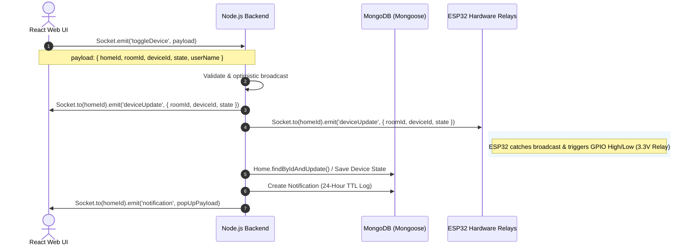
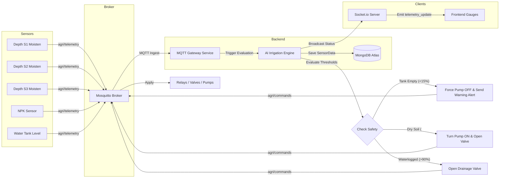
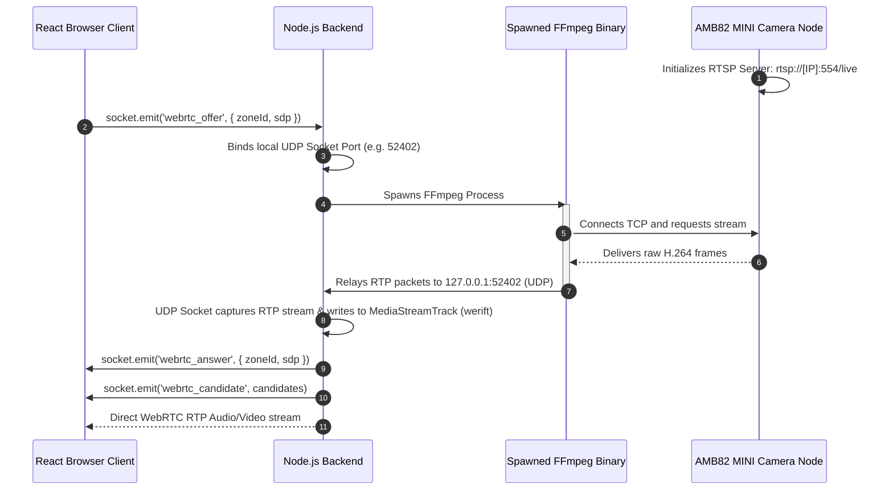
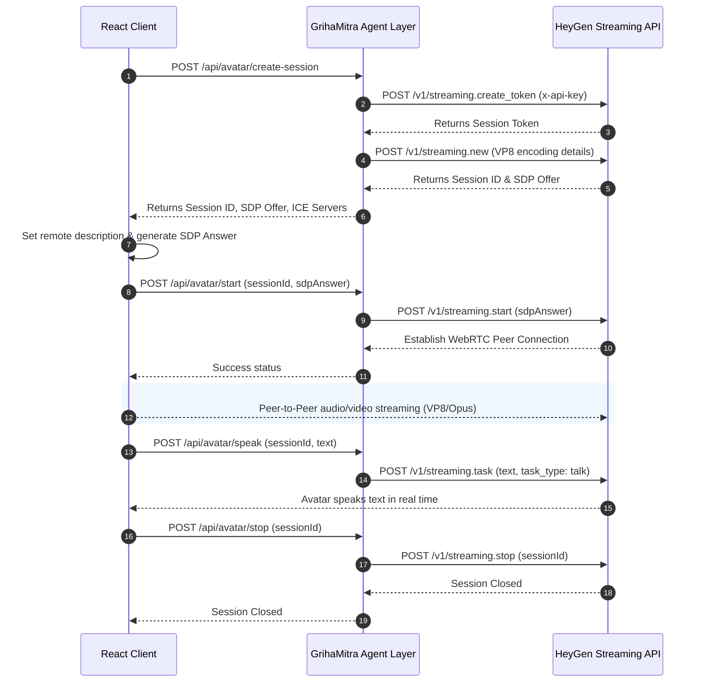
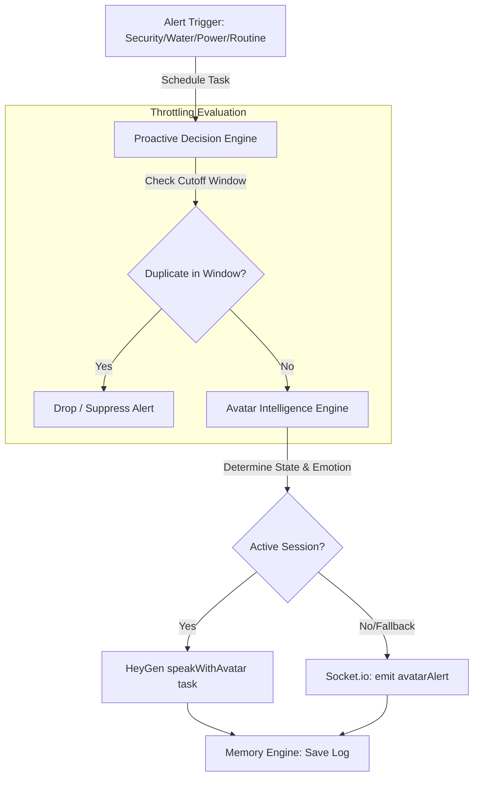

# ☘️ Smart Home & AI Companion Ecosystem (Sapno Ka Ghar)
## End-to-End Data Pipeline & Communication Specifications

This document defines the data pipelines, communication protocols, network topologies, and processing flows implemented in the **Sapno Ka Ghar** (GrihaMitra) ecosystem.

---

## 🏗️ 1. High-Level Architectural Flow

GrihaMitra uses modular communication paths orchestrated by a centralized agent layer to handle real-time control, IoT telemetry ingestion, low-latency video streaming, decoupled AI tasks, and companion avatar dialogues:

```
┌────────────────────────────────────────────────────────────────────────┐
│                        React Frontend Dashboard                        │
└─────┬───────────────▲───────────────┬──────────────────────────▲───────┘
      │               │               │ (WebRTC A/V)             │ (WebRTC)
      │ (HTTP REST)   │ (Socket.io)   │                          │
      ▼               │               ▼                          │
┌─────────────┐       │       ┌───────────────┐                  │
│   Node.js   ├───────┴───────► FFmpeg Binary  │                  │
│ API Server  │               └───────▲───────┘                  │
└─────┬───────┴───────────────────────┼──────────────────────────┼───────┘
      │ (Task Queues)                 │ (RTSP Stream)            │
      ▼                               │                          │
┌───────────────────────────────┐     │                          │
│     GrihaMitra Agent Layer    │     │                          │
│  (Context, Memory, Explain,   │     │                          │
│   Voice, Avatar, Predictive)  │     │                          │
└─────┬───────────────┬─────────┘     │                          │
      │               │               │                          │
      ▼               ▼               ▼                          │
┌─────────────┐ ┌─────────────┐ ┌───────┴───────┐          ┌───────┴───────┐
│ Python AI   │ │ AWS Services│ │  AMB82 MINI   │          │    HeyGen     │
│ Microservice│ │ (Bedrock /  │ │  Smart Camera │          │ Streaming API │
│ (Whisper)   │ │  Polly)     │ │               │          │               │
└─────────────┘ └─────────────┘ └───────────────┘          └───────────────┘
```

---

## ⚡ 2. Pipeline A: Real-Time Smart Home Actuation (Socket.io)

This pipeline manages low-latency, bi-directional commands between React clients and home automation hardware (such as ESP32 nodes controlling 3.3V GPIO physical relays).

### Sequence Flow


---

## 🍀 3. Pipeline B: Smart Gardening & AI Irrigation (MQTT)

This pipeline processes high-volume soil telemetry, runs rule-based safety checks, and manages automation for agricultural pumps and drainage valves.

### Sequence Flow


---

## 📹 4. Pipeline C: Live Camera Streaming (RTSP to WebRTC)

This pipeline establishes a direct peer-to-peer WebRTC stream from camera hardware (AMB82 MINI) to the browser client without intermediate cloud transcoding.



---

## 🧠 5. Pipeline D: GrihaMitra Agent Layer Workflow (BullMQ & Redis)

This pipeline operates as the central cognitive processing unit. It decouples high-latency AI tasks into organized agent engines to ensure smooth API responses and resilient memory handling.

```mermaid
graph TD
    UserAudio[Client Voice Input] -->|Socket Stream| NodeBE[Express Route / API]
    
    subgraph GrihaMitra Agent Layer
        NodeBE -->|Enqueue Job| VoiceInt[Voice Intelligence Engine]
        VoiceInt -->|1. Transcribe (FastAPI Whisper)| STTResult[Transcript]
        
        STTResult -->|2. Context Aggregation| ContextEng[Context Engine]
        ContextEng -->|Retrieve History| MemEng[Memory Engine]
        
        MemEng -->|3. Query Bedrock| Bedrock_Q[Bedrock Reasoning]
        Bedrock_Q -->|Generate Explanation| ExplainEng[Explainability Engine]
        
        ExplainEng -->|4. Speech Synthesis| AvatarInt[Avatar Intelligence Engine]
        AvatarInt -->|Trigger Polly TTS| Polly_Q[Polly Synthesis]
    end
    
    Polly_Q -->|Broadcast Audio/WebRTC| ClientUI[Avatar UI Dashboard]
    Polly_Q -->|Save Logs| Analytics[Analytics Queue -> MongoDB]
```

### Components of the GrihaMitra Agent Layer:
- **Context Engine**: Aggregates family profiles, sensor arrays, and active routines.
- **Memory Engine**: Interacts with MongoDB `AvatarMemory` and `ConversationSession` to provide semantic recall to the LLM.
- **Routine Learning Engine**: Maps behavioral patterns into predictable `AIRoutine` documents.
- **Predictive Automation Engine**: Evaluates confidence thresholds before actively controlling home devices.
- **Explainability Engine**: Translates complex probabilistic model logic into friendly human sentences.
- **Voice Intelligence Engine**: Runs speech transcription, language detection, and determines interaction intent.
- **Avatar Intelligence Engine**: Controls HeyGen WebRTC streams, adapts emotions, and modulates avatar behavior states.
- **Proactive Decision Engine**: Driven by BullMQ schedulers to process critical asynchronous events (e.g., Security, Water Tank Alerts).

---

## 👤 6. Pipeline E: HeyGen Streaming Avatar Integration

This pipeline provides low-latency virtual companion avatars via a server-controlled WebRTC streaming session.

### Interactive Session Life-cycle


---

## 📢 7. Pipeline F: Proactive Decision Engine (Scheduler)

This engine manages alerts and predictive recommendations, preventing voice overlap and flooding using priority queue scheduling and throttling windows.

### Flow Architecture


### Priority and Throttling Matrix
| Alert Type | Cutoff Window | Queue Priority | Target Emotion | Target State | Description |
| :--- | :--- | :---: | :--- | :--- | :--- |
| **security** | 30 seconds | 1 (Highest) | Alert | Alerting | Unauthorized entry, perimeter break alerts |
| **water_tank** | 3 minutes | 2 | Concerned | Alerting | Low water level warnings |
| **power_failure** | 3 minutes | 2 | Concerned | Alerting | Main grid power loss warnings |
| **routine** | 10 minutes | 3 (Lowest) | Normal | Speaking | Inferred family routine triggers |
| **prediction** | 10 minutes | 3 (Lowest) | Normal | Speaking | Household predictive automation warnings |

---

## 🔊 8. Custom Speech Profiles & Audio Filesystem Cache

This pipeline maps family member roles to distinct Polly voices and caches generated MP3 audio files on the local filesystem to avoid redundant API fees.

### Audio Caching Mechanism
```
Synthesize Request ("Text String", Role)
        ↓
Convert Role to Profile (VoiceId, Rate)
        ↓
SSML Text = <speak><prosody rate="Rate">Escaped Text</prosody></speak>
        ↓
MD5 Hash = md5(SSML_Text + VoiceId)
        ↓
Check Local File System: public/temp_audio/[MD5_Hash].mp3
        ├─► [File Exists] ────► Stream cached MP3 file (Zero AWS charges)
        └─► [File Missing] ───► Call Amazon Polly Neural API
                                     ↓
                                Write MP3 to public/temp_audio/
                                     ↓
                                Record AIUsageMetrics cost telemetry
                                     ↓
                                Stream new MP3 file
```

---

## 📊 9. Telemetry & AI Usage Cost Ingestion

The backend records usage metadata inside the `AIUsageMetrics` collection to track cloud expenses in real time.

### Calculation Parameters
1. **Amazon Bedrock (Nova Lite)**: Input \$0.06 / 1M tokens, Output \$0.24 / 1M tokens
2. **Amazon Bedrock (Nova Pro)**: Input \$0.80 / 1M tokens, Output \$3.20 / 1M tokens
3. **Amazon Polly (Neural Engine)**: \$16.00 / 1M Characters
4. **Amazon Polly (Standard Engine)**: \$4.00 / 1M Characters

---

## 🔒 10. Access Control & Sandbox Telemetry

The ecosystem isolates each home to protect hardware and configuration settings from cross-tenant operations:

1. **REST Authentication**: Calls must provide a JWT in the `Authorization: Bearer <token>` header, containing the encrypted `userId` and `role`.
2. **WebSocket Quarantine**:
   - Clients request access to a home using `socket.emit('joinHome', { homeId })`.
   - The backend checks member configurations in MongoDB.
   - If authorized, the socket joins the isolated space: `socket.join(homeId)`.
3. **Granular Room Access**: Sub-members can only fetch and control devices inside rooms listed in their `accessibleRooms` array.
