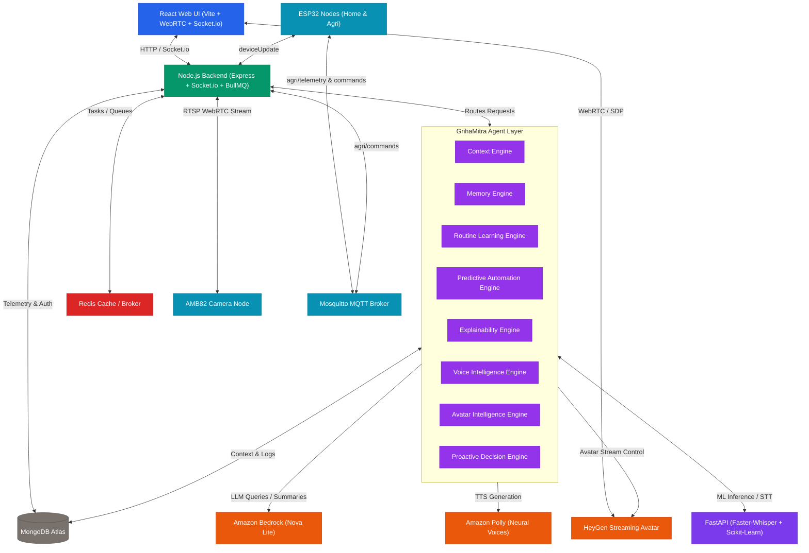

# 🏡 Sapno Ka Ghar (GrihaMitra) — Smart Home & AI Companion Avatar Ecosystem

Welcome to **Sapno Ka Ghar** (GrihaMitra), a hybrid local-cloud smart home automation ecosystem integrated with a decentralized cognitive agentic layer, real-time telemetry pipelines, low-latency WebRTC live stream relays, and a natural human-avatar companion dialogue interface.

This project delivers a multi-user, multi-tenant smart dashboard which connects real smart home appliances and sensors (via ESP32, MQTT, and WebSockets) with cutting-edge cloud AI systems, including **Amazon Bedrock (Nova Lite)**, **Amazon Polly (Neural)**, and **HeyGen WebRTC Streaming Avatars**.

---

## 🏛️ System Architecture Overview

GrihaMitra is designed with a decoupled three-tier microservice architecture to isolate low-latency hardware switching from high-latency AI model reasoning.



### 1. Frontend Layer (`/Frontend`)
Built using **Vite + React.js + Tailwind CSS**, the client app handles real-time user dashboard interactions, socket events sync, WebRTC video streaming from camera nodes, and peer-to-peer audio-video connections to the HeyGen streaming avatar.

### 2. Core API Backend (`/Backend`)
Built on **Node.js, Express, and Socket.io**, the backend manages multi-tenant user authentication (JWT), maps home layouts (homes, rooms, devices), orchestrates background AI job queues via **BullMQ + Redis**, and logs telemetry events in **MongoDB Atlas**.

### 3. AI Service (`/AIService`)
A CPU-optimized **FastAPI** service running:
* **Speech-to-Text**: High-accuracy transcription via `faster-whisper` (utilizing CPU `int8` quantization).
* **Predictive Learning**: An offline **Scikit-Learn Random Forest Classifier** that trains on MongoDB event histories to output confidence scores for upcoming smart home commands.

---

## 🧠 The GrihaMitra Agent Layer

The **GrihaMitra Agent Layer** is the cognitive engine of the ecosystem, comprising 11 isolated engines interacting to provide reasoning, long-term memory, and personalized interaction:

1. **Voice Intelligence Engine**: Transcribes audio inputs, maps language intents (Hinglish/English), and filters out low-confidence queries (below 60%).
2. **Context Engine**: Aggregates room temperatures, device states, family member profiles, and schedules to assemble the prompt context window.
3. **Memory Engine**: Manages multi-turn conversation logs and long-term semantic avatar recall, triggering text summaries to compress chat histories.
4. **Routine Learning Engine**: Identifies frequent device triggers (3+ occurrences at specific hours) to create structured `AIRoutine` records.
5. **Predictive Automation Engine**: Evaluates ML predictions and applies confidence thresholds to toggle devices automatically or recommend suggestions.
6. **Explainability Engine**: Translates probabilistic algorithms and feature importances into friendly human explanations (stored in `ExplainabilityRecord` logs).
7. **Avatar Intelligence Engine**: Controls WebRTC states, translates conversational prompts into emotional categories, and modulates HeyGen's states.
8. **Proactive Decision Engine**: Evaluates environment anomalies (security, low water, grid failure) and schedule announcements through BullMQ.
9. **Planning Engine**: Assembles multi-step sequential action plans for complex command requests.
10. **Knowledge Engine**: Matches user queries against custom smart home manual entries and local FAQs.
11. **Vision Intelligence Engine**: Interfaces with AMB82 camera nodes to run local visual analysis.

---

## ⚡ Asynchronous Task Pipelines (BullMQ & Redis)

To keep API routes non-blocking and avoid UI freezes during high-latency AI calls, the backend utilizes **BullMQ** to process commands asynchronously through a 5-stage pipeline:

```
[Audio Input Base64]
         ↓
 1. SpeechToText Queue (FastAPI Whisper transcribes audio into text)
         ↓
 2. BedrockProcessing Queue (Context enrichment, multi-turn session retrieval, Amazon Bedrock reasoning)
         ↓
 3. PollyGeneration Queue (Neural audio synthesis from custom family-member voice mapping)
         ↓
 4. VoiceAnalytics Queue (Updates MongoDB, toggles Socket.io commands, saves VoiceHistory logs)
         ↓
[Audio Stream Base64 + Device State Actuation Broadcast]
```

*If Redis goes offline, the backend automatically logs warning telemetry and falls back to a synchronous execution chain to ensure continuous operation.*

---

## 🛣️ Core Data & Communication Pipelines

### Pipeline A: Low-Latency Device Actuation (Socket.io)
When a user toggles an appliance on the React dashboard:
1. The client emits `toggleDevice` with the target `homeId`, `roomId`, `deviceId`, and `state`.
2. The server updates MongoDB, logs a `Notification` event, and broadcasts `deviceUpdate` and `notification` to all active clients in the home's socket room.
3. Connected **ESP32 hardware relays** immediately parse the WebSocket message and toggle their physical GPIO pins.
4. If this toggle overrides a recent AI automatic trigger (within 15 minutes), the server flags the ML prediction as `Manual Override` to retrain the model.

### Pipeline B: Smart Gardening & AI Irrigation (MQTT)
1. Agricultural sensors (soil moisture, water tank level, NPK) publish telemetry to Mosquitto MQTT under the topic `agri/telemetry`.
2. The backend MQTT Gateway parses the payload and logs it in MongoDB.
3. The AI Irrigation Engine evaluates telemetry rules:
   * **Dry Soil + Tank Level > 15%**: Publishes a command to turn on irrigation pumps (`agri/commands`).
   * **Dry Soil + Tank Level <= 15%**: Suppresses pump operation and publishes a critical water warning alert.
   * **Waterlogged Soil (> 90%)**: Activates drainage valves.
4. Broadcasts telemetry logs to frontend dashboards using Socket.io.

### Pipeline C: Live Camera Streaming (RTSP to WebRTC)
1. The **AMB82 MINI smart camera** hosts a local RTSP feed: `rtsp://[IP]:554/live`.
2. When the user opens the camera view, the client requests a WebRTC session.
3. The backend server establishes a local UDP port and spawns an **FFmpeg** subprocess.
4. FFmpeg decodes H.264 frames from the camera's RTSP feed and relays raw RTP packets to the backend's UDP socket.
5. The backend captures the RTP stream, wraps it into a WebRTC media track using `werift`, and negotiates peer-to-peer streaming directly to the user's browser.

### Pipeline D: Predictive Automation Decision Matrix
Every 5 minutes, a background cron loop evaluates device predictions for all active family members. The execution paths are determined by confidence scores:

| Confidence Score | Execution Path | DB Result | Action |
| :--- | :--- | :--- | :--- |
| **> 90%** | Autonomous Actuation | `Success` | Toggles device ON immediately, logs explainability details, and schedules a proactive voice announcement. |
| **70% - 90%** | Conditional Approval | `Pending Approval` | Logs a pending decision and sends a socket request to the React client asking for user validation. |
| **< 70%** | Passive Recommendation | `Recommendation` | Logs the prediction as a system recommendation without executing any commands. |

### Pipeline E: HeyGen Streaming Avatar Lifecycle
1. The client sends a `POST /api/avatar/create-session` request.
2. The server requests a session token from the HeyGen API and initializes a WebRTC SDP offer.
3. The server forwards the SDP offer and ICE servers back to the client.
4. The client browser sets its remote description, creates an SDP answer, and submits it to `POST /api/avatar/start`.
5. The server finalizes the WebRTC peer connection to establish low-latency VP8/Opus audio-video streaming.
6. The client calls `POST /api/avatar/speak` to dispatch text messages to the avatar.

### Pipeline F: Voice Synthesis & Local Cache
To avoid redundant Polly API cost accumulations:
1. Synthesize requests are converted into SSML tags wrapping the member's profile tone and voice.
2. The server generates an MD5 hash of the SSML payload: `md5(SSML_Text + VoiceId)`.
3. If `public/temp_audio/[MD5].mp3` exists, the server streams the cached audio file immediately.
4. If not found, it calls Amazon Polly, saves the resulting stream as a cached file, and logs cost metrics.

---

## 💾 Database Schemas

MongoDB Atlas persistent data collections manage smart home state details:

* **User**: Profiles, encrypted passwords, roles (Admin, Owner, Member).
* **Home**: House name, authorized invitation codes, list of rooms, devices (light, fan, AC, pump), and local sensors.
* **FamilyMember**: Profile metadata ( Grandmother, Parent, Student modes), aiMode (Predictive/Manual), preferred languages, and background AI evaluation logs.
* **ConversationSession**: Chat context, average response latencies, active intent maps, and conversational summary strings.
* **AvatarMemory**: Conversational turns, emotional classifications, and response logs.
* **PredictiveDecision**: Audit log tracking ML outputs, confidence levels, overrides, and approval states.
* **ExplainabilityRecord**: Explanations generated by Amazon Bedrock detailing why an ML execution was triggered.
* **AIUsageMetrics**: Tracks costs for Bedrock tokens, Polly character counts, and API failures.

---

## 🚀 Getting Started & Local Setup

### Prerequisites
* **Node.js** (v18+)
* **Python** (v3.9+)
* **MongoDB** (local server or Atlas cluster)
* **Redis** (local instance running on port 6379)
* **FFmpeg** binaries (installed and added to system PATH)

---

### Step 1: Clone and Configure Backend
1. Navigate to the backend directory:
   ```bash
   cd Backend
   ```
2. Install dependencies:
   ```bash
   npm install
   ```
3. Create a `.env` file in `/Backend`:
   ```env
   PORT=5000
   MONGO_URI=your_mongodb_atlas_connection_string
   JWT_SECRET=your_jwt_signing_key
   REDIS_HOST=127.0.0.1
   REDIS_PORT=6379
   
   # AWS Settings
   AWS_ACCESS_KEY_ID=your_aws_access_key
   AWS_SECRET_ACCESS_KEY=your_aws_secret_key
   AWS_REGION=us-east-1
   
   # HeyGen Settings
   HEYGEN_API_KEY=your_heygen_key
   ```
4. Start the server:
   ```bash
   npm run dev
   ```

---

### Step 2: Configure FastAPI AI Service
1. Navigate to the AI service directory:
   ```bash
   cd AIService
   ```
2. Create and activate a python virtual environment:
   ```bash
   python -m venv venv
   .\venv\Scripts\activate
   ```
3. Install dependencies:
   ```bash
   pip install -r requirements.txt
   ```
4. Start the FastAPI service:
   ```bash
   uvicorn main:app --host 127.0.0.1 --port 8000 --reload
   ```

---

### Step 3: Configure Frontend Client
1. Navigate to the frontend directory:
   ```bash
   cd Frontend
   ```
2. Install package dependencies:
   ```bash
   npm install
   ```
3. Start the development server:
   ```bash
   npm run dev
   ```
4. Access the web dashboard at `http://localhost:5173`.

---

## 🔒 Security & Tenant Sandbox Isolation

1. **REST Route Protection**: API endpoints validate JWT headers (`Authorization: Bearer <Token>`) to confirm tenant IDs and restrict access based on member roles.
2. **WebSocket Isolation**: Sockets connect to separated rooms mapped to `homeId`. Commands are broadcasted strictly inside these isolated channels to prevent cross-tenant device activation.
3. **API Key Encapsulation**: Cloud integrations (AWS credentials, HeyGen access tokens) remain secured on the backend. The React frontend interacts solely through authenticated Express proxy routes.

---

*Made with ❤️ for Sapno Ka Ghar (Home of Dreams).*
